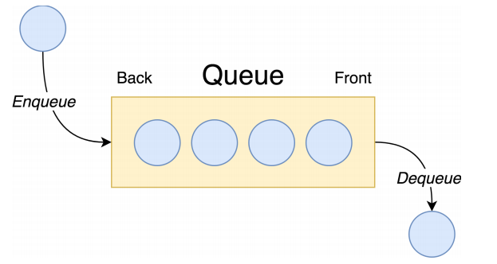

A queue is a collection of entities that are stored in First-in-First-out order. A commonly seen implementation of Queue in the real world are lines in supermarket where the first shopper in line served first.

# **The Main operations:**
- *Enqueue :* Add new entity to the rear position
- *Dequeue :* remove entity from the front position
- *Peek :* Reading the entity from the front with out dequeuing it

***NB :*** The operations like searching and updating elements are not common for queues.

# **The Use Case:**
- Queues can be found in different *messaging applications* where messages are generate faster than they are processed.
- Queues are used also as a Data structure for other Algorithms like in *Graph*.

#  Implementation:

A queue can be implemented with Linked List, The structure and operations on Linked List are similar on to a Queue.  
